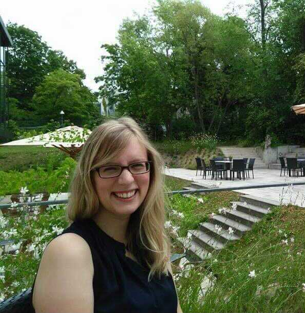
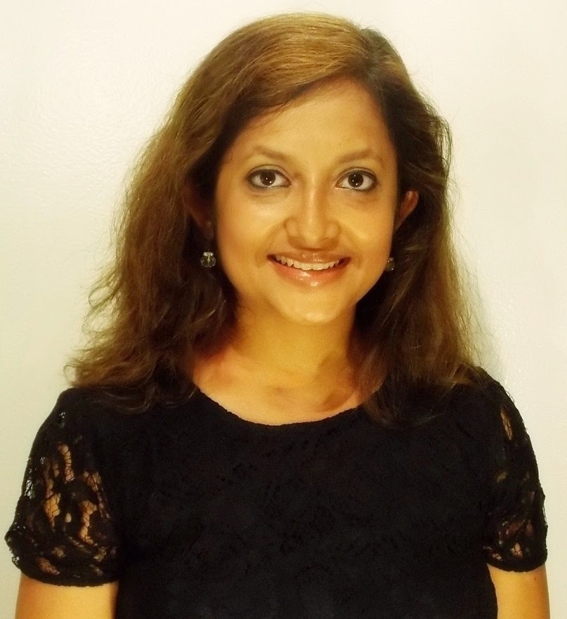

  
# Life after grad school  
Hear from successful professionals about life as a data scientist in academia, industry, government, consulting, and non-profit organizations. 
Attendees will learn about the work experiences and skills that contribute to success in each sphere.

**Keywords:** Data Science in Academia, Industry, Consulting

## About the panelists

 **[Aimee Schwab-McCoy](https://aimeeschwab-mccoy.github.io/)** is an Assistant Professor of Statistics and Data Science at Creighton University in Omaha, NE. Dr. Schwab-McCoy is the Director of the Data Science Major and Minor, and directs undergraduate research projects in statistical modeling and machine learning. Her research interests are primarily in statistics and data science education, pedagogy, and curriculum development. She also works in spatial modeling, generalized linear mixed modeling (GLMMs), and is an active statistical consultant.      

 **Sohini Roychowdhury, Director of Curriculum, Fourth Brain** comes from both the academic and industry worlds of applied ML/AI. Most recently she was the Technical AI and Head of University Relations at VolvoCars USA, and prior to that a tenure track Assistant Professor in Electrical and Computer Engineering at University of Washington. She has applied machine learning and AI models on problems ranging from epidemiology, diagnostic medicine, supply chain management, computer vision detection modules to e-commerce streamlining, and her latest area of research is learning from sparse data, especially applied to medical research and automotive domains. Research and teaching are her passion. 

Read more on her program/model development, projects, 60 published papers, patents (27 with 3 granted) and thesis students here. 
My work webpage is: https://www.fourthbrain.ai/about-us      

 **Beth M. Duckles, PhD** is a research consultant and organizational sociologist who helps technologists, designers and scientists work with and collect human centered data. She has worked with and consulted with Fortune 100 firms, federal agencies, science based nonprofits and startups as well as teaching courses for graduate and undergraduates on social science methods. She is the founder of [Open Post Academics](https://openpostac.org/) which is a peer support group that encourages people with a PhD to share their knowledge and expertise openly. 
