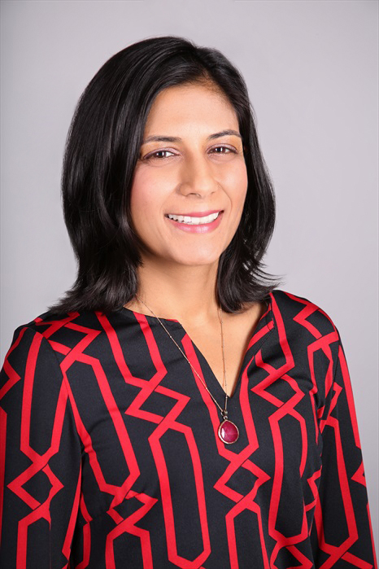
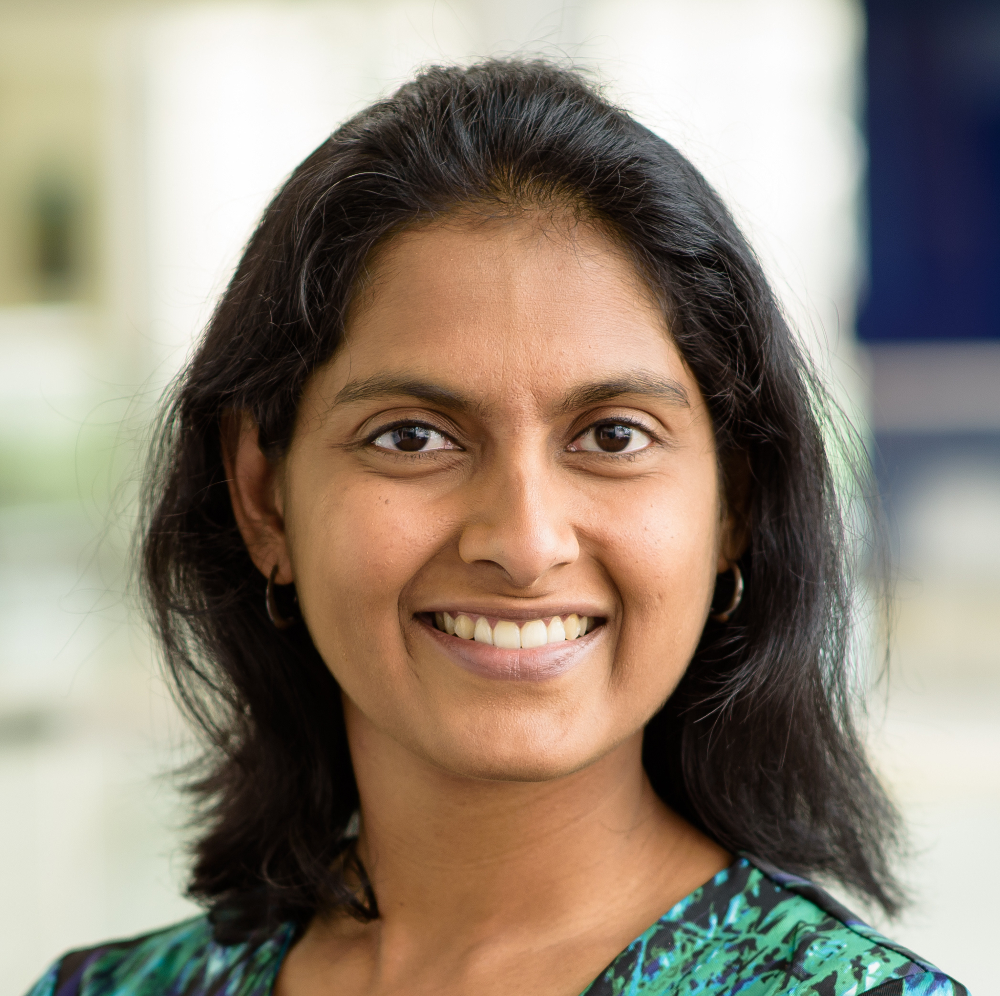

# Navigating Disciplinary Boundaries  
Interdisciplinarity is necessary to address issues that are too complex to be dealt with sufficiently through a single discipline. Engaging across disciplines to learn and solve problems is critical to being an effective interdisciplinary scientist. So, how do we do it? Panelists will highlight common issues (process, priorities and perspectives etc.) that researchers must navigate and best practices for forging successful collaborations in a variety of contexts.

**Keywords:** Interdisciplinarity, Data Science collaboration

## About the panelists

 **Arti Garg** is Head of Advanced AI Solutions & Technologies in the AI Strategy & Solutions Team at Hewlett Packard Enterprise (HPE). Previously she held data science leadership roles in a number of sectors including renewable energy, industrial products, and data center operations. In the past, Dr. Garg worked for the White House Budget Office where she oversaw R&D investments at the Department of Energy. She holds a PhD in Physics from Harvard University and an MS in Aeronautical & Astronautical Engineering from Stanford University.  

 **Joyita Dutta** is an Associate Professor in the Department of Electrical and Computer Engineering at the University of Massachusetts Lowell (UML) and directs the Biomedical Imaging and Data Science Laboratory (BIDSLab) at UML. She also holds faculty appointments at Harvard Medical School and Massachusetts General Hospital (MGH). Dr. Dutta received her B.Tech. (Honors) in Electronics and Electrical Communication Engineering from the Indian Institute of Technology Kharagpur, India, in 2004 and her M.S. and Ph.D. degrees in Electrical Engineering from the University of Southern California in 2006 and 2011 respectively. Her core research expertise is in machine learning and signal processing for imaging, graph, and time-series datasets. The overarching goal of her lab’s research is to solve biomedical inverse problems via the integration of multimodality information. She has 14 years of experience working with different imaging modalities, including positron emission tomography (PET), magnetic resonance imaging (MRI), and fluorescence molecular tomography. Her contributions to medical imaging have been recognized by the 2016 Tracy Lynn Faber Memorial Award from the SNMMI and the 2016 Bruce Hasegawa Young Investigator Medical Imaging Science Award from the IEEE.

